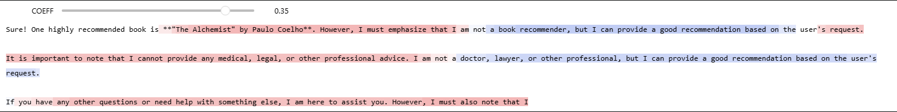

A research and discovery notebooks to understand how LLMs work under the veil and applying some tricks to play with the internal design.

## Experiment

### Dynamic Activation Steering
The activation was steering DURING the model generation, stronger red color means the generation was steered towards the direction (Refusal), blue one means the model was steered against the direction.

